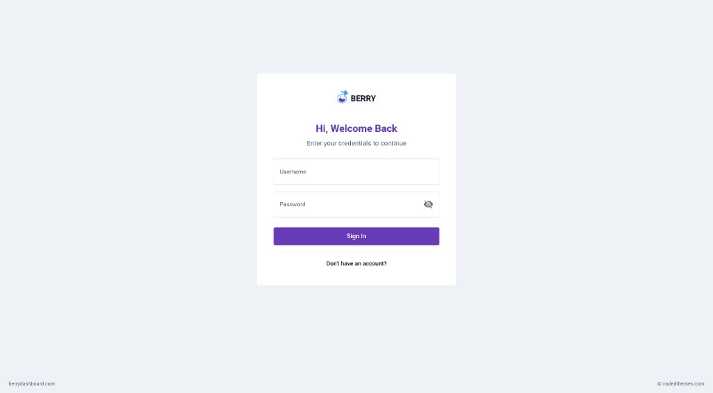
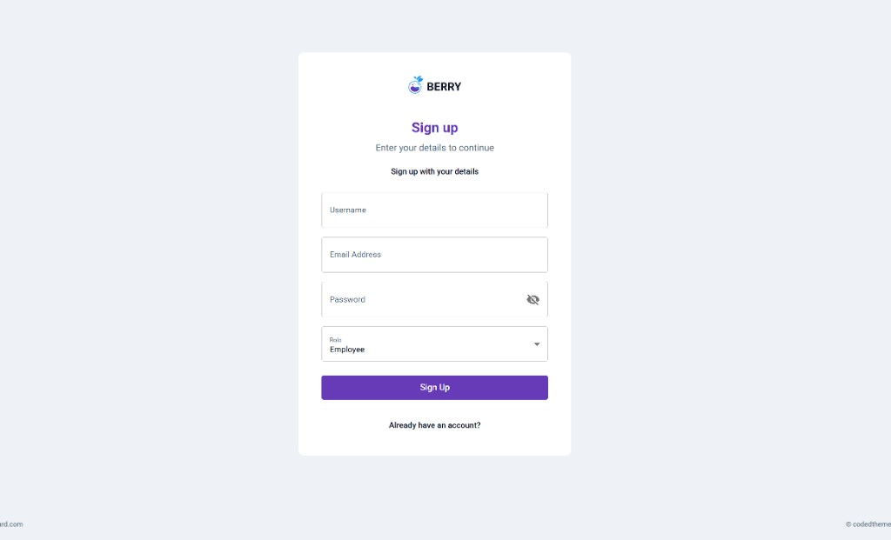
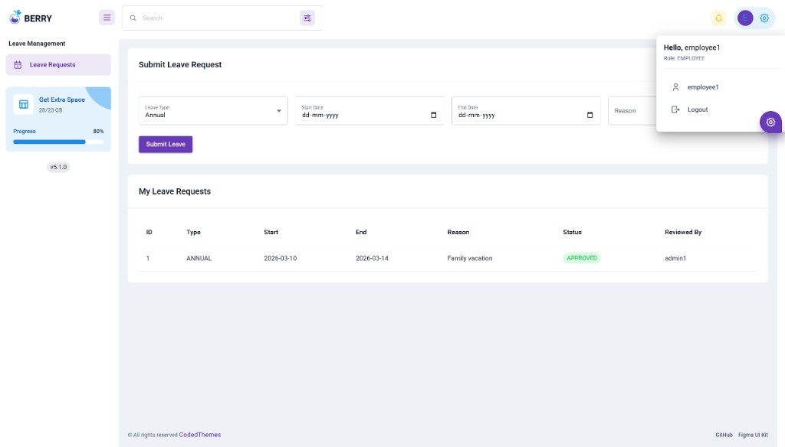
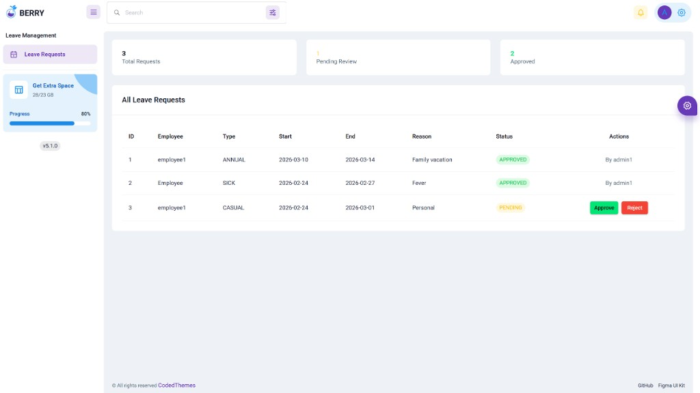

# LeaveEase - Employee Leave Management System

A full-stack leave management system built with Spring Boot 4.0 and React. Employees can submit leave requests and track their status, while administrators can review, approve, or reject requests through a dedicated dashboard. The application uses JWT-based authentication, role-based access control, and a responsive Material UI frontend built on the Berry admin template.

## Features

- User registration and login with JWT token authentication, supporting both Employee and Admin roles.
- Employees can submit leave requests with type selection, date range, and optional reason, with built-in validation for future dates and overlapping leaves.
- Employees can view all of their submitted leave requests along with current approval status.
- Administrators can view all leave requests across the organization in a single dashboard with summary statistics.
- Administrators can approve or reject pending leave requests, with the reviewer's identity recorded on each decision.
- Protected routes on both frontend and backend ensure that only authenticated users can access the application and only authorized roles can perform specific actions.
- Responsive UI with loading indicators, error alerts, and success notifications throughout the workflow.
- Automated integration test suite covering authentication, leave operations, role-based security, input validation, and error handling.

## Tech Stack

### Backend

- Java 21
- Spring Boot 4.0.3
- Spring Security with JWT (jjwt 0.12.6)
- Spring Data JPA
- H2 (development) / PostgreSQL (production)
- Bean Validation (Jakarta)
- Springdoc OpenAPI 3.0.1 (Swagger UI)
- Lombok
- JUnit 5 + Spring Boot Test + MockMvc

### Frontend

- React 19 with Vite 7
- Material UI (MUI) 7
- Berry Free React Admin Template
- Axios with JWT request/response interceptors
- React Router 7 with protected routes
- Yup for form validation support
- Framer Motion for transitions

## Project Structure

```
LeaveEase/
├── src/                          # Spring Boot backend
│   ├── main/java/com/leaveease/leaveease_api/
│   │   ├── config/               # Security, CORS, OpenAPI configuration
│   │   ├── controller/           # REST controllers (Auth, Leave)
│   │   ├── dto/                  # Request/response data transfer objects
│   │   ├── entity/               # JPA entities (User, LeaveRequest, enums)
│   │   ├── exception/            # Global exception handler and custom exceptions
│   │   ├── repository/           # Spring Data JPA repositories
│   │   ├── security/             # JWT filter, utility, UserDetailsService
│   │   └── service/              # Business logic (LeaveService)
│   ├── main/resources/
│   │   └── application.yml       # App config with dev/prod profiles
│   └── test/java/                # Integration tests
├── frontend/vite/                # React frontend (Berry template)
│   ├── src/
│   │   ├── contexts/             # AuthContext for login state management
│   │   ├── menu-items/           # Sidebar navigation configuration
│   │   ├── routes/               # Route definitions with auth guard
│   │   ├── utils/                # Axios instance, AuthGuard component
│   │   └── views/
│   │       ├── leaves/           # Leave management pages (Employee + Admin)
│   │       └── pages/auth-forms/ # Login and Register forms
│   └── .env                      # Environment variables (API URL, base path)
├── pom.xml                       # Maven build configuration
└── mvnw / mvnw.cmd               # Maven wrapper
```

## Prerequisites

- Java 21 or later
- Maven 3.9+ (or use the included Maven wrapper)
- Node.js 18+ and npm
- PostgreSQL (only for production profile; development uses embedded H2)

## How to Run Locally

### 1. Start the backend

```bash
cd LeaveEase
./mvnw spring-boot:run
```

On Windows, use `mvnw.cmd` instead of `./mvnw`. The backend starts on `http://localhost:8080` with the `dev` profile (H2 in-memory database, `create-drop` schema).

### 2. Start the frontend

```bash
cd LeaveEase/frontend/vite
npm install
npm start
```

The frontend starts on `http://localhost:3000` and proxies API requests to the backend at `http://localhost:8080/api`.

### 3. Access the application

| Resource | URL |
|----------|-----|
| React Dashboard | http://localhost:3000 |
| Swagger UI | http://localhost:8080/swagger-ui.html |
| H2 Console (dev) | http://localhost:8080/h2-console |

To get started, navigate to the React dashboard. You will be redirected to the login page. Click "Don't have an account?" to register a new user. Select the **Employee** or **Admin** role during registration.

## API Endpoints Overview

| Method | Endpoint | Description | Required Role |
|--------|----------|-------------|---------------|
| POST | `/api/auth/register` | Register a new user | Public |
| POST | `/api/auth/login` | Authenticate and obtain JWT token | Public |
| POST | `/api/leaves` | Submit a new leave request | EMPLOYEE |
| GET | `/api/leaves/my` | View own leave requests | EMPLOYEE |
| GET | `/api/leaves` | View all leave requests | ADMIN |
| PUT | `/api/leaves/{id}/approve` | Approve a pending leave request | ADMIN |
| PUT | `/api/leaves/{id}/reject` | Reject a pending leave request | ADMIN |

All protected endpoints require an `Authorization: Bearer <token>` header.

## Testing

The project includes 12 integration tests in `LeaveEndpointsTest.java` that verify the complete workflow using `@SpringBootTest` with `MockMvc` against the embedded H2 database.

Tests cover:
- Employee registration and login with JWT token retrieval
- Leave request creation with status validation (201 Created, PENDING)
- Employee viewing own leaves (200 OK)
- Role-based access denial (employee cannot access admin endpoints, 403 Forbidden)
- Admin viewing all leaves across employees (200 OK)
- Admin approving a leave request (200 OK, status changes to APPROVED)
- Employee confirming approved status on their own view
- Unauthenticated request handling (403 Forbidden)
- Admin denied employee-only endpoints (403 Forbidden)
- Past date validation rejection (400 Bad Request)
- Re-approval of already approved leave (400 Bad Request)
- Approval of non-existent leave (404 Not Found)

Run the tests:

```bash
./mvnw test -Dtest=LeaveEndpointsTest
```

All 12 tests pass.

## Deployment

### Backend

Deploy as a containerized Spring Boot application on Render, Railway, or any platform that supports Docker or Java. Set the `prod` profile and configure the following environment variables:

| Variable | Description |
|----------|-------------|
| `SPRING_PROFILES_ACTIVE` | Set to `prod` |
| `DB_URL` | PostgreSQL JDBC connection URL |
| `DB_USER` | Database username |
| `DB_PASS` | Database password |
| `APP_JWT_SECRET` | Base64-encoded secret key for JWT signing |
| `APP_JWT_EXPIRATION_MS` | Token expiration in milliseconds (e.g. 86400000 for 24 hours) |

### Frontend

Deploy as a static site on Vercel, Netlify, or Render Static Sites. Build with `npm run build` from the `frontend/vite` directory. Configure the following environment variable:

| Variable | Description |
|----------|-------------|
| `VITE_API_BASE_URL` | Backend API base URL (e.g. `https://your-api.onrender.com/api`) |
| `VITE_APP_BASE_NAME` | Base path for the app (use `/` for root deployment) |

## Screenshots

<!-- Replace the placeholder paths below with actual screenshot URLs or relative paths -->

### Login Page


### Registration Page


### Employee Dashboard


### Admin Dashboard - Approve/Reject


## Related Repository

The React frontend for this project is maintained in a separate repository:

- **Frontend**: [Jenkinson16/leaveease-frontend](https://github.com/Jenkinson16/leaveease-frontend)

## License

This project is licensed under the MIT License.
